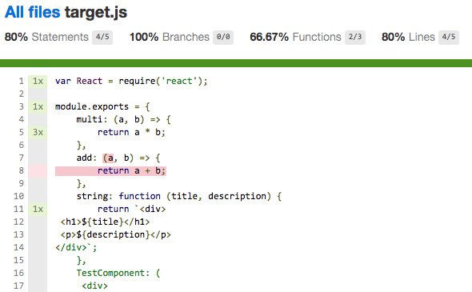
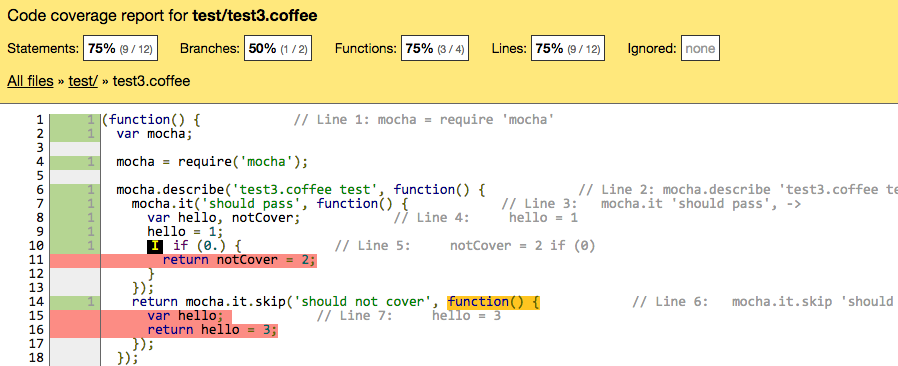

gulp-jsx-coverage
=================

Enable istanbul coverage on .JSX or .coffee files when you do mocha tests.

[](https://www.npmjs.org/package/gulp-jsx-coverage) [](https://david-dm.org/zordius/gulp-jsx-coverage) [](https://travis-ci.org/zordius/gulp-jsx-coverage) [](LICENSE.txt)

**This is not a gulp plugin, it just a task creator to help you deal with istanbul instrumenter and collect coverage report in gulp**

Features
--------

* Help you create a gulp task to handle mocha testing + istanbul coverage
* Compile .jsx and .coffee files on the fly
* Customized everything by options
* Extract sourceMaps to hint original codes in istanbul reports




Install
-------

```
npm install gulp-jsx-coverage mocha --save-dev
```

* You will need to install coffee-script when you require('foobar.coffee')

Usage
-----

* The golden rule: **Use .jsx as ext name** , require('file.jsx')
* The golden rule: **Use .coffee as ext name** , require('file.coffee')
* No need to use transform tools to register .jsx or .coffee for require()

```javascript
gulp.task('your_task_name', require('gulp-jsx-coverage').createTask({
    src: ['test/**/*.js', 'test/components/*.jsx'],  // will pass to gulp.src
    istanbul: {                                      // will pass to istanbul
        coverageVariable: '__MY_TEST_COVERAGE__',
        exclude: /node_modules|\/test\//             // pattern to skip instrument
    },
    coverage: {
        reporters: ['text-summary', 'json', 'lcov'], // list of istanbul reporters
        directory: 'coverage'                        // will pass to istanbul reporters
    },
    mocha: {                                         // will pass to mocha
        reporter: 'spec'
    },
    react: {                                         // will pass to react-tools
        sourceMap: true                              // true to get hints in HTML covarage reports
    },
    coffee: {                                        // will pass to coffee.compile
        sourceMap: true                              // true to get hints in HTML coverage reports
    }
}));
```

Live Example
------------

```sh
git clone https://github.com/zordius/gulp-jsx-coverage.git
cd gulp-jsx-coverage
npm install
npm test
```

**Output**:

```
[14:10:58] Using gulpfile ~/gulp-jsx-coverage/gulpfile.js
[14:10:58] Starting 'default'...


  test1.js coverage
    ✓ should covered 

  test2.jsx
    ✓ should covered 
    - should not covered

  test3.coffee test
    ✓ should pass 
    - should not cover


  3 passing (31ms)
  2 pending

-------------------|-----------|-----------|-----------|-----------|
File               |   % Stmts |% Branches |   % Funcs |   % Lines |
-------------------|-----------|-----------|-----------|-----------|
   test/           |     85.71 |        50 |     78.57 |     85.71 |
      target.js    |     66.67 |       100 |        50 |     66.67 |
      test1.js     |       100 |       100 |       100 |       100 |
      test2.jsx    |     92.86 |       100 |     83.33 |     92.86 |
      test3.coffee |        75 |        50 |        75 |        75 |
-------------------|-----------|-----------|-----------|-----------|
All files          |     85.71 |        50 |     78.57 |     85.71 |
-------------------|-----------|-----------|-----------|-----------|

[14:10:59] Finished 'default' after 671 ms
```

* Check <a href="gulpfile.js">gulpfile.js</a> for the sample input.
* Check <a href="coverage">coverage</a> directory for the sample output.
