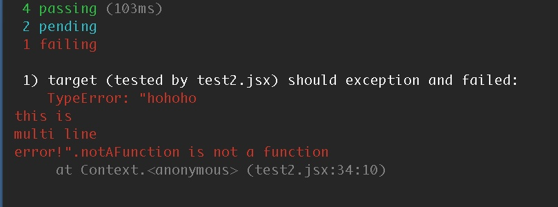

gulp-jsx-coverage
=================

Enable istanbul coverage on ES2015/babel files when you do mocha/jasmine tests, also deal with sourceMap for stack trace....as gulp task.

[](https://www.npmjs.org/package/gulp-jsx-coverage) [](https://www.npmjs.org/package/gulp-jsx-coverage) [](https://david-dm.org/zordius/gulp-jsx-coverage) [](https://travis-ci.org/zordius/gulp-jsx-coverage) [](LICENSE.txt)

Features
--------

* Help you create a gulp task to handle mocha testing + istanbul coverage
* Transpile .jsx and ES2015 .js files on the fly
* Use <a href="https://github.com/babel/babel">babel (6to5)</a> to transpile .js and .jsx files so you can use <a href="http://babeljs.io/docs/learn-es2015/">ES2015 features</a> inside your .js and .jsx files!
* Customize everything by options
* sourceMaps on stack traces when mocha test failed (powered by <a href="https://github.com/evanw/node-source-map-support">source-map-support</a>)
* coverage threshold

---

**original codes/line in coverage reports**


**original codes/line in stack traces**


Usage
-----

1. Install
==========
```
npm install gulp gulp-jsx-coverage babel-plugin-istanbul --save-dev
```

2. Configure Babel
==================
Configure your <a href="https://babeljs.io/docs/usage/babelrc/">.babelrc</a> and install proper <a href="https://babeljs.io/docs/plugins/">presets or plugins</a>.

Here is a .babelrc example:
```
{presets: ['es2015']}
```
And then:
```
npm install babel-preset-es2015
```

Best Practices
--------------

* The golden rule: **Use .jsx as ext name** when jsx syntax inside it. Require it by `require('file.jsx')`.
* When you develop a module, do not use any module loader hooks. (Refer to <a href="https://babeljs.io/docs/usage/require/">Babel require hook document</a>)
* Excludes transpiler directories as possible as you can to improve performance.
* When you develop an application, you may use module loader hooks. But, don't enable the hook when you do testing.

Usage: General Mocha Test Creator
---------------------------------

```javascript
gulp.task('your_task_name', require('gulp-jsx-coverage').createTask({
    src: ['test/**/*.js', 'test/components/*.jsx'],  // will pass to gulp.src as mocha tests

    istanbul: {                                      // will pass to istanbul, this is default setting
        exclude: /node_modules|test[0-9]/            // do not instrument these files
    },

    threshold: [                                     // fail the task when coverage lower than one of this array
        {
            type: 'lines',                           // one of 'lines', 'statements', 'functions', 'banches'
            min: 90
        }
    ],

    babel: {                                         // this is default setting
        include: /\.jsx?$/,
        exclude: /node_modules/,
        omitExt: false                               // if you wanna omit file ext when require(), put an array
    },                                               // of file exts here. Ex: ['.jsx', '.es6'] (NOT RECOMMENDED)

    coverage: {
        reporters: ['text-summary', 'json', 'lcov'], // list of istanbul reporters
        directory: 'coverage'                        // will pass to istanbul reporters
    },

    mocha: {                                         // will pass to mocha
        reporter: 'spec'
    },

    //optional
    cleanup: function () {
        // do extra tasks after test done
        // EX: clean global.window when test with jsdom
    }
}));
```

Usage: Other Testing Frameworks
-------------------------------

```javascript
var GJC = require('gulp-jsx-coverage');
var jasmine = require('gulp-jasmine');

gulp.task('my_jasmine_tests', function () {
    GJC.initModuleLoader(GJCoptions);                     // Refer to previous gulp-jsx-coverage options

    return gulp.src('test/*.js')
    .pipe(jasmine(jasmineOptions))
    .on('end', GJC.collectIstanbulCoverage(GJCoptions));  // Refer to previous gulp-jsx-coverage options
});
```

Live Example: mocha
-------------------

```sh
git clone https://github.com/zordius/gulp-jsx-coverage.git
cd gulp-jsx-coverage
npm install
npm run mocha
```

**Output**:

```
 ~/gulp-jsx-coverage master>npm run mocha

> gulp-jsx-coverage@0.3.8 mocha /Users/zordius/gulp-jsx-coverage
> gulp mocha_tests

[11:50:14] Using gulpfile ~/gulp-jsx-coverage/gulpfile.js
[11:50:14] Starting 'mocha_tests'...


  target (tested by test1.js)
    ✓ should multiply correctly
    - should not show coverage info for test1.js
    ✓ should handle es2015 template string correctly

  target (tested by test2.jsx)
    ✓ should multiply correctly (77ms)
    - should not show coverage info for test2.jsx
    1) should exception and failed

  Component.jsx (tested by test2.jsx)
    ✓ should render Hello World


  4 passing (104ms)
  2 pending
  1 failing

  1) target (tested by test2.jsx) should exception and failed:
     TypeError: "hohoho
 this is
 multi line
 error!".notAFunction is not a function
      at Context.<anonymous> (test2.jsx:34:10)


[11:50:16] 'mocha_tests' errored after 1.86 s
[11:50:16] Error in plugin 'gulp-mocha'
Message:
    1 test failed.
---------------|----------|----------|----------|----------|----------------|
File           |  % Stmts | % Branch |  % Funcs |  % Lines |Uncovered Lines |
---------------|----------|----------|----------|----------|----------------|
All files      |    90.48 |      100 |       75 |    90.48 |                |
 Component.jsx |       75 |      100 |       50 |       75 |              5 |
 target.js     |       80 |      100 |    66.67 |       80 |              8 |
 testlib.js    |      100 |      100 |      100 |      100 |                |
---------------|----------|----------|----------|----------|----------------|
```

* Check <a href="gulpfile.js">gulpfile.js</a> for the sample input.
* Check <a href=".babelrc">.babelrc</a> for the sample babel config.
* Check <a href="http://zordius.github.io/gulp-jsx-coverage/lcov-report/">coverage report</a> directory for the sample output.

Upgrade Notice
--------------

**0.4.0**
* Core changed:
  * do not support isparta now
  * do not support coffee-script/cjsx now
  * do not support options.babel now (please use .babelrc)
  * do not support options.istanbul.coverageVariable now
  * move to <a href="https://github.com/istanbuljs">istanbul.js</a> and <a href="https://github.com/istanbuljs/babel-plugin-istanbul">babel-plugin-istanbul</a> now

**0.3.2**

* API changed:
  * you should rename all colloectIstanbulCoverage into collectIstanbulCoverage

**0.3.0**

* Babel upgraded:
  * You should add proper options.babel.plugins or options.babel.presets to transpile your script properly. Please refer to http://babeljs.io/docs/plugins/

* API changed:
  * you should rename all initIstanbulHookHack into initModuleLoaderHack

**0.2.0**

* the sourceMap stack trace feature requires:
  * mocha >= 2.2.2
  * the options.babel.sourceMap should be changed from 'inline' to 'both'
