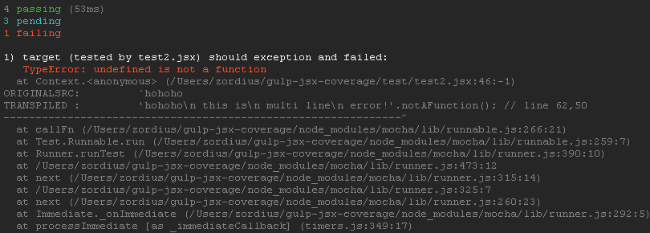
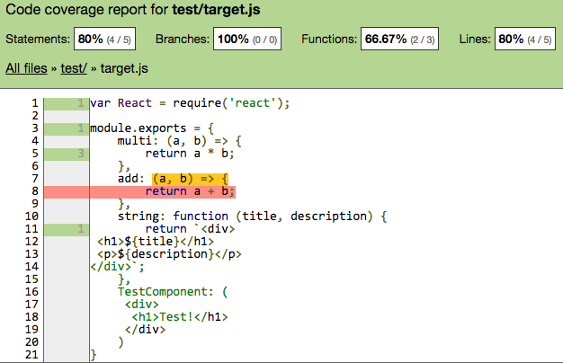

gulp-jsx-coverage
=================

Enable istanbul or isparta coverage on ES2015/babel or coffee-script files when you do mocha/jasmine tests, also deal with sourceMap for coverage report and stack trace.

[](https://www.npmjs.org/package/gulp-jsx-coverage) [](https://www.npmjs.org/package/gulp-jsx-coverage) [](https://david-dm.org/zordius/gulp-jsx-coverage) [](https://travis-ci.org/zordius/gulp-jsx-coverage) [](LICENSE.txt)

Features
--------

* Help you create a gulp task to handle mocha testing + istanbul coverage
* Transpile .jsx, .coffee, and ES2015 .js files on the fly
* Use <a href="https://github.com/babel/babel">babel (6to5)</a> to transpile .js and .jsx files so you can use <a href="http://babeljs.io/docs/learn-es2015/">ES2015 features</a> inside your .js and .jsx files!
* Customize everything by options
* Extract sourceMaps to hint original codes in istanbul reports
* sourceMaps on stack traces when mocha test failed
* coverage threshold
* **0.3.0 NEW** support isparta

Check this chart to see features when gulp-jsx-coverage work with different coverage tools:

| Features \ Coverage Tool | istanbul   | isparta  |
| -------------------------|------------|----------|
| Mocha testing            | ✅          | ✅        |
| Jasmine testing          | ✅          | ✅        |
| syntax: jsx              | ✅          | ✅        |
| syntax: ES2015           | ✅          | ✅        |
| syntax: coffee-script    | ✅          | ❌        |
| coverage report          | transpiled | original |

* **istanbul+mocha:hint original codes (jsx/es2015) in coverage reports**

* **istanbul+mocha:hint original coffee-script in coverage reports**

* **mocha:show original code/line when test failed**

* **isparta+mocha:show original codes in coverage reports**


Install
-------

```
npm install gulp-jsx-coverage mocha --save-dev
```

* You will need to install <a href="https://www.npmjs.com/package/coffee-script">coffee-script</a> when you require('foobar.coffee') or write tests as foobar.coffee
* You will need to install <a href="https://github.com/douglasduteil/isparta">isparta</a> when you enable isparta
* Regular JavaScript files with .js extension may use ES2015 features

Best Practices
--------------

* The golden rule: **Use .jsx as ext name** when jsx syntax inside it. Require it by `require('file.jsx')`.
* The golden rule: **Use .coffee as ext name** when coffee script inside it. Require it by `require('file.coffee')`.
* When you develop a module, do not use any module loader hooks. (Refer to <a href="https://babeljs.io/docs/usage/require/">Babel require hook document</a>)
* Excludes transpiler directories as possible to improve performance.
* When you develop an application, you may use module loader hooks. But, don't enable the hook when you do testing.

Usage: General Mocha Test Creator
---------------------------------

```javascript
gulp.task('your_task_name', require('gulp-jsx-coverage').createTask({
    src: ['test/**/*.js', 'test/components/*.jsx'],  // will pass to gulp.src as mocha tests
    isparta: false,                                  // use istanbul as default
    istanbul: {                                      // will pass to istanbul or isparta
        preserveComments: true                       // required for istanbul 0.4.0+
        coverageVariable: '__MY_TEST_COVERAGE__',
        exclude: /node_modules|test[0-9]/            // do not instrument these files
    },

    threshold: 80,                                   // fail the task when coverage lower than this
                                                     // default is no threshold
    thresholdType: 'functions',                      // one of 'lines', 'statements', 'functions', 'banches'
                                                     // default is 'lines'

    transpile: {                                     // this is default whitelist/blacklist for transpilers
        babel: {
            include: /\.jsx?$/,
            exclude: /node_modules/,
            omitExt: false                           // if you wanna omit file ext when require(), put an array
        },                                           // of file exts here. Ex: ['.jsx', '.es6'] (NOT RECOMMENDED)
        coffee: {
            include: /\.coffee$/,
            omitExt: false                           // if you wanna omit file ext when require(), put an array
        }                                            // of file exts here. Ex: ['.coffee'] (NOT RECOMMENDED)
    },
    coverage: {
        reporters: ['text-summary', 'json', 'lcov'], // list of istanbul reporters
        directory: 'coverage'                        // will pass to istanbul reporters
    },
    mocha: {                                         // will pass to mocha
        reporter: 'spec'
    },
    babel: {                                         // will pass to babel-core
        presets: ['es2015', 'react'],                // Use proper presets or plugins for your scripts
        sourceMap: 'both'                            // get hints in covarage reports or error stack
    },
    coffee: {                                        // will pass to coffee.compile
        sourceMap: true                              // true to get hints in HTML coverage reports
    },

    //optional
    cleanup: function () {
        // do extra tasks after test done
        // EX: clean global.window when test with jsdom
    }
}));
```

Usage: Other Testing Frameworks
-------------------------------

```javascript
var GJC = require('gulp-jsx-coverage');
var jasmine = require('gulp-jasmine');

gulp.task('my_jasmine_tests', function () {
    GJC.initIstanbulHook(GJCoptions); // Refer to previous gulp-jsx-coverage options

    return gulp.src('test/*.js')
    .pipe(jasmine(jasmineOptions))
    .on('end', GJC.collectIstanbulCoverage(GJCoptions));
});
```

Usage: Use Isparta
------------------

```javascript
gulp.task('your_task_name', require('gulp-jsx-coverage').createTask({
    src: ['test/**/*.js', 'test/components/*.jsx'],
    isparta: true,
    ....
});
```

**NOTE: do not support coffee-script when using isparta as coverage tool**
* Check <a href="http://zordius.github.io/gulp-jsx-coverage/2/lcov-report/">coverage report</a> directory for the sample output.

Live Example: mocha
-------------------

```sh
git clone https://github.com/zordius/gulp-jsx-coverage.git
cd gulp-jsx-coverage
npm install
npm run mocha_test
```

**Output**:

```
[13:00:52] Using gulpfile ~/gulp-jsx-coverage/gulpfile.js
[13:00:52] Starting 'default'...


  target (tested by test1.js)
    ✓ should multiply correctly
    - should not show coverage info for test1.js
    ✓ should handle es6 template string correctly

  target (tested by test2.jsx)
    ✓ should multiply correctly
    - should not show coverage info for test2.jsx

  target (tested by test3.coffee)
    ✓ should multiply correctly
    - should not show coverage info for test3.coffee


  4 passing (42ms)
  3 pending

----------------|-----------|-----------|-----------|-----------|
File            |   % Stmts |% Branches |   % Funcs |   % Lines |
----------------|-----------|-----------|-----------|-----------|
   test/        |        80 |       100 |     66.67 |        80 |
      target.js |        80 |       100 |     66.67 |        80 |
----------------|-----------|-----------|-----------|-----------|
All files       |        80 |       100 |     66.67 |        80 |
----------------|-----------|-----------|-----------|-----------|

[13:00:53] Finished 'default' after 642 ms
```

* Check <a href="gulpfile.js">gulpfile.js</a> for the sample input.
* Check <a href="http://zordius.github.io/gulp-jsx-coverage/lcov-report/">coverage report</a> directory for the sample output.

Upgrade Notice
--------------

**0.3.2**

* API changed:
  * you should rename all colloectIstanbulCoverage into collectIstanbulCoverage

**0.3.0**

* Babel upgraded:
  * You should add proper options.babel.plugins or options.babel.presets to transpile your script properly. Please refer to http://babeljs.io/docs/plugins/

* API changed:
  * you should rename all initIstanbulHookHack into initModuleLoaderHack

**0.2.0**

* the sourceMap stack trace feature requires:
  * mocha >= 2.2.2
  * the options.babel.sourceMap should be changed from 'inline' to 'both'
